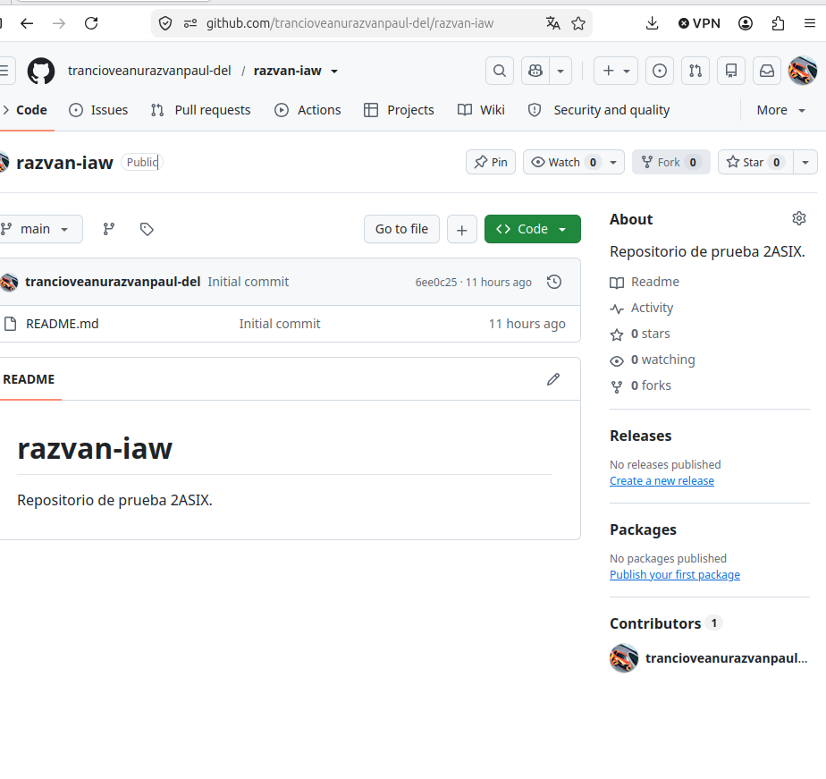

# Apunts d'IAW - Introducció a Markdown

Document de prova per a la sintaxi **Markdown**.

---

## 1. Elements bàsics
- **Text en negreta**
- *Text en cursiva*
- ~~Text ratllat~~

## 2. Imatges i Enllaços

### Imatge que és un enllaç a una URL externa
Fes clic sobre la imatge per a anar a la pàgina de GitHub:

### Imatge local (carpeta img)
A continuació es mostra la imatge guardada al directori local:

---

## 3. Navegació del repositori
👉 [Anar al segon document](document2.md)
